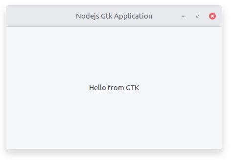

# Node Gtk Boilerplate

A boilerplate to build gnome native applications using nodejs.



## Usage

* Clone Repo:
```git clone https://github.com/nmanumr/node-gtk-boilerplate.git```

* Install dependencies (Refer to [node-gtk guide](https://www.npmjs.com/package/node-gtk#installing-and-building) for more details):
```npm install```

* Copy node-gtk bindings:
```cp ./node_modules/node-gtk/lib/binding/[BINDING_VERSION]/node_gtk.node ./lib/binding/```

* Test run:
```npm start```

**Bundling for flatpak**

* Install flatpak: https://flatpak.org/setup/

* Install flatpack runtime:
```flatpak install flathub org.gnome.Platform//3.28 org.gnome.Sdk//3.28```

* Bundle the app:
```npm run pack```

* Install flatpak bundle:
```npm run flatpak:install```

* Run bundled app:
```npm run flatpak:run```

## References

* [node-gtk](https://github.com/romgrk/node-gtk#documentation)
* [pkg docs](https://github.com/zeit/pkg/blob/master/README.md)
* [flatpak-bundler](https://github.com/endlessm/flatpak-bundler#flatpak-bundler--)